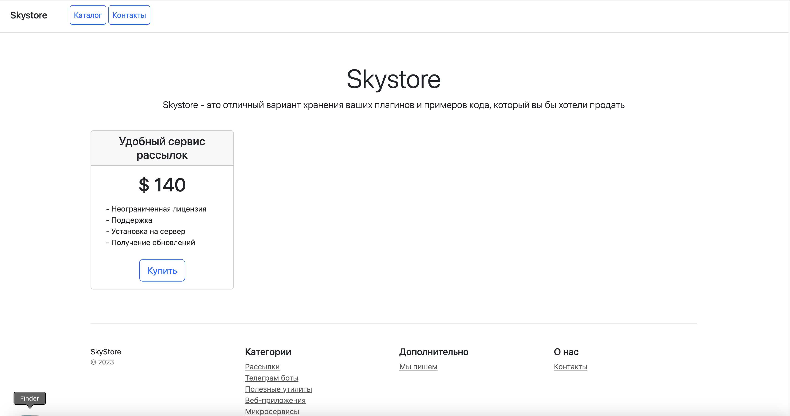
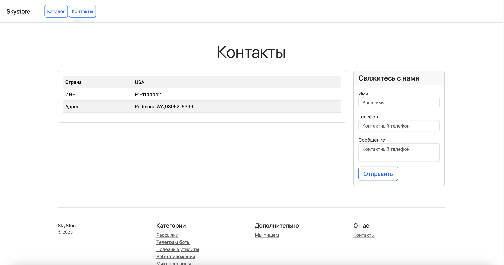

# Интернет-магазин "Skystore"


[1. Цель проекта](#title1) / 
[2. Описание HTML-страниц](#title2) / 
[3. Контроллеры](#title3) / 
[4. Модели](#title4) / 
[5. Админка](#title5) / 
[6. Кастомные команды](#title6) / 
[7. Шаблонные фильтры/теги](#title7) / 
[8. Django-формы](#title8) / 
[9. Модуль config.py](#title9) / 
[10. Установка проекта](#title10) / 
[11. Получение ключей](#title11) /


## <a id="title1">1. Цель проекта</a>
Создание проекта Django для интернет-магазина "Skystore".
Интернет-магазина для хранения разнообразных плагинов и примеров кода, который будет продаться.

1. Получить базовые навыки работы с ***Bootstrap***;
2. Получить базовые навыки работы с ***Django***.

    
## <a id="title2">2. Описание HTML-страниц</a>
1. Реализованы следующие HTML-страницы (`catalog/templates/catalog/`):


   - шаблонные страницы:
     - ***base.html***: общий (базовый) шаблон для всех пользовательских страниц, который включает общие элементы страницы, такие как шапка, подвал и стили;
     - ***menu.html***: подшаблон, в котором описано главное меню для всех пользовательских страниц;
     - ***paginator.html***: подшаблон, в котором описана пагинация (переключение страниц) для главной страницы.


   - пользовательские страницы:
     - ***home.html***: главная страница приложения;
     - ***contacts.html***: страница с контактными данными интернет-магазина;
     - ***product.html***: страница с детальной информацией выбранного продукта;
     - ***add_your_product.html***: страница с формой, которая позволяет пользователю самостоятельно добавлять продукт в БД магазина;
     - ***product_confirm_delete.html***: страница с формой, которая запрашивает у пользователя подтверждение удаления продукта из магазина.


2. Для части страниц в БТ были представлены макеты (макеты размещены по адресу: `media/html_patterns/`):
   - ***media/html_patterns/Home_page.html***: содержит HTML-шаблон для страницы "Главная", согласно прототипа из ТЗ:
   
    
   - ***media/html_patterns/Contacts_page.html***: содержит HTML-шаблон для страницы "Контакты", согласно прототипа из ТЗ:
   
   
   - Страницы, по которым не было предоставлено явных требований к шаблонам в БТ, реализация выполнялась на основе стилизации предыдущих шаблонов.

   
## <a id="title3">3. Описание контроллеров (view) в `catalog/views.py`</a>

1) В проекте используется определение и обработка представлений с помощью классов (CBV: class-based view):


   - `class CatalogListView(ListView)` - представление для отображения домашней страницы (***home.html***) с пагинацией:
     - Обрабатываемые запросы:
       - **GET-запрос**: контроллер рендерит шаблон home.html.
     - **def get_queryset(self)**: для целей отладки контроллер выводит в консоль последние 5 созданных продуктов.
     - С помощью встроенного инструмента Paginator контроллер создает пагинацию страниц (постраничный вывод товаров на главной странице и переключение между страницами).


   - `class CatalogDetailView` - представление для отображения страницы с подробной информацией о продукте (***product.html***):
     - Обрабатываемые запросы:
       - **GET-запрос**: контроллер рендерит шаблон product.html.
         - при рендере шаблона GET-запрос выполняет запрос к модели Product, которая запрашивает по Primary Key (pk) в БД необходимый экземпляр (таблица "catalog_products") и импортирует от туда детальную информацию о продукте для product.html.


   - `class CatalogCreateView` - представление для отображения страницы с формой (***add_your_product.html***), которая позволяет пользователю добавлять новые товары в БД:
     - Обрабатываемые запросы:
       - **GET-запрос**: контроллер рендерит шаблон add_your_product.html;
       - **POST-запрос**: контроллер вызывает форму для добавления пользователем нового товара (форма создана в forms.py);
       - **form_valid**: отправка пользователю уведомления о том, что его продукт успешно добавлен.


   - `class CatalogUpdateView` - представление для редактирования продукта в магазине (***add_your_product.html***):
     - Обрабатываемые запросы:
       - **GET-запрос**: контроллер рендерит шаблон add_your_product.html;
       - **POST-запрос**: контроллер вызывает форму для редактирования пользователем существующего товара;
       - **form_valid**: перенаправление на страницу с деталями продукта после успешного редактирования.


   - `class CatalogDeleteView` - представление для удаления продукта в магазине (***product_confirm_delete.html***):
     - Обрабатываемые запросы:
       - **GET-запрос**: контроллер рендерит шаблон product_confirm_delete.html;
       - **POST-запрос**: удаление пользователем существующего товара;
       - **form_valid**: отправка пользователю уведомления о том, что продукт был удален.


   - `class CatalogContactsView` - представление для отображения страницы "Контакты" (***contacts.html***).
     - Обрабатываемые запросы:
       - **GET-запрос**: контроллер рендерит шаблон contacts.html;
         - **get_context_data**: при рендере шаблона GET-запрос выполняет запрос к модели ContactsData, которая хранит контактные данные интернет-магазина в БД (таблица "catalog_contacts_data") и импортирует от туда контактные данные для contacts.html;
       - **form_valid** (**POST-запрос**): добавление отзыва пользователя в БД (модель Feedback) и отправка пользователю уведомления о том,
        что его обратная связь успешно отправлена.


2) Настроена маршрутизация для данных контроллеров в модуле ***catalog/urls.py***.
В маршрутизации используется пространство имен app_name = CatalogConfig.name = Catalog.


## <a id="title4">4. Описание моделей (models) в `сatalog/models.py`</a>

1) Реализация модели ***Category***, которая представляет категорию товаров в интернет-магазине:
   - наименование (category_name);
   - описание (description).


2) Реализация модели ***Product***, которая представляет товар в интернет-магазине:
   - наименование (product_name);
   - описание (description);
   - изображение (image);
   - категория (category);
   - цена за покупку (price);
   - дата создания (created_at);
   - дата последнего изменения (updated_at).


3) Реализация модели ***ContactsData*** для хранения контактных данных интернет-магазина:
   - страна (country);
   - ИНН (tax_id);
   - адрес (address).


4) Реализация модели ***Feedback*** для хранения обратной связи от пользователей интернет-магазина:
   - Имя пользователя (name);
   - Телефон пользователя (phone);
   - Сообщение от пользователя (message).


## <a id="title5">5. Описание настроек админки (admin) в `сatalog/admin.py`</a>

1) Для модели *"Category"* в админке настроено отображение данных (***CategoryAdmin***):
   - Отображаемые поля: "id", "category_name";
   - Поля поиска: "category_name", "description".


2) Для модели *"Product"* в админке настроено отображение данных (***ProductAdmin***):
   - Отображаемые поля: "id", "product_name", "price", "category";
   - Поля фильтрации: "category";
   - Поля поиска: "product_name", "description".


3) Для модели *"ContactsData"* в админке настроено отображение контактных данных (***ContactsDataAdmin***):
   - Отображаемые поля: "country", "tax_id", "address".


4) Для модели *"Feedback"* в админке настроено отображение обратной связи (***FeedbackAdmin***):
   - Отображаемые поля: "id", "name", "phone", "message".


## <a id="title6">6. Описание кастомных команд в `сatalog/management/commands/`</a>

1) Для модели *"Category"* созданы следующие кастомные команды:
   - `create_category_fixture.py` - кастомная команда для СОЗДАНИЯ фикстуры для модели Category;
   - `add_categories.py` - кастомная команда для ЗАГРУЗКИ данных в БД из фикстуры.


2) Для модели *"Product"* созданы следующие кастомные команды:
   - `create_product_fixture.py` - кастомная команда для СОЗДАНИЯ фикстуры для модели Product;
   - `add_products.py` - кастомная команда для ЗАГРУЗКИ данных в БД из фикстуры.


## <a id="title7">7. Описание шаблонных фильтров/тегов в `сatalog/templatetags/`</a>
Шаблонный фильтр `media_filter(path)` - шаблонный фильтр для изображений, который обрабатывает путь из БД и адаптирует его для HTML-страниц приложения.


## <a id="title8">8. Описание форм для ввода и сохранения пользовательских данных в `сatalog/forms.py`</a>
1) Форма `ProductForm(forms.ModelForm)` - Django-форма для удобной валидации и пользовательского добавления/обновления продуктов на странице add_your_product.html.
   - Методы формы:
     - `clean_product_name` - валидация атрибута формы 'product_name', которая проверяет отсутствие запрещенных слов в данном поле;
     - `clean_description` - валидация атрибута формы 'description', которая проверяет отсутствие запрещенных слов в данном поле;
     - `clean_price` - валидация атрибута формы 'price', которая проверяет что цена не отрицательная.

    
2) Форма `ContactForm(forms.Form)` - Django-форма для заполнения и отправки пользователем обратной связи на странице contacts.html.


## <a id="title9">9. Описание модуля `config/config.py`</a>
В модуле записан список запрещенных слов (константы), которые будут использоваться в методах валидации определенных полей в формах приложений `Catalog` и `Blog`.

Именно из-за того, что эти запрещенные слова релевантны не только для названия/описания Products (приложение Catalog), но и для Articles (приложение Blog) принято решение хранить это в ***config.py***.

Содержание модуля `config/config.py`:
1. ***FORBIDDEN_WORDS*** = {"казино", "криптовалюта", "крипта", "биржа", "дешево", "бесплатно", "обман", "полиция", "радар"}


## <a id="title10">10. Установка проекта</a>
1. Клонируйте репозиторий:
```
git clone https://github.com/MaksimLakovich/Homework-4-python-DJANGO-PROJECT.git
```

2. Установите зависимости:
```
pip install -r requirements.txt
```


## <a id="title11">11. Получение ключей. Описание файла .env.example</a> 
1. Создайте файл .env в корне проекта из копии подготовленного файла `.env.example`, в котором описаны названия всех переменных, необходимых для работы приложения.
2. Замените значения переменных реальными данными.
3. В модуле `settings.py` существует секретный ключ `SECRET_KEY`, который рекомендуется в целях безопасности хранить в тайне:
4. Файл .env должен содержать данные:
   - Настройки секретного ключа проекта:
     - SECRET_KEY_FOR_PROJECT = *secret_key_here*
   - Настройки дебага (обратить внимание, что в settings.py дебаг дополнительно должен быть описан так: DEBUG = True if os.getenv('DEBUG') == 'True' else False):
     - DEBUG = True
   - Настройки БД:
     - DATABASE_SKYSTORE = *write_here*
     - DATABASE_USER = *write_here*
     - DATABASE_PASSWORD = *write_here*
     - DATABASE_HOST = *write_here*
     - DATABASE_PORT = *write_here*
